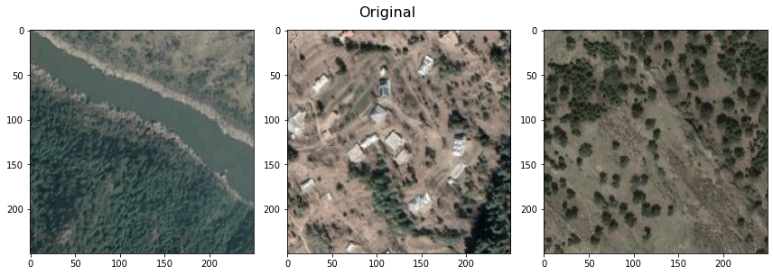
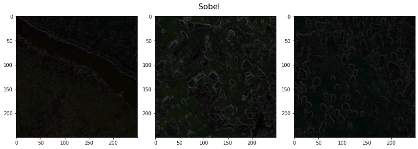
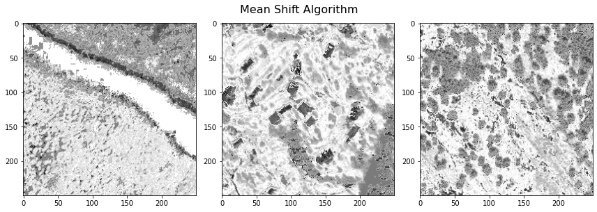

# Image Preprocessing techniques
The jupyter notebook displays the usage of popular image pre-processing filters using the skimage framework. The filters are applied to 3 sample images and the resulting images are displayed.

## Sample results

